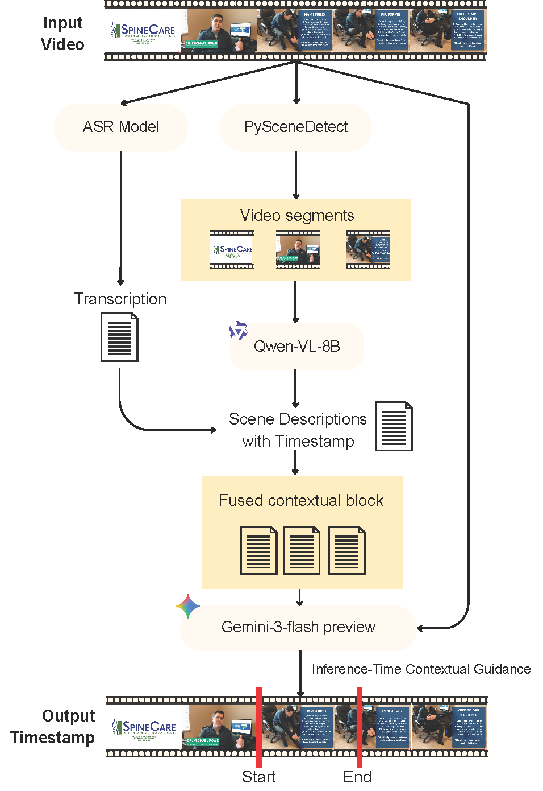

# LAMAR-2 at MedGenVidQA 2026: Visual Answer Localization in Medical Videos via Multimodal LLM and Context-Augmented Prompting
This repository contains the official code, prompts, and evaluation scripts for the **LAMAR-2** submission to the MedGenVidQA 2026 Shared Task (Task C).  —  #1 on leaderboard.
## System Overview
We frame visual answer localization as a multimodal fusion problem, integrating raw video, timestamped ASR transcripts, and VLM-generated scene descriptions into structured contextual blocks, enabling the model to cross-reference spoken commentary against observable physical events. We show that targeted guidance, which forces the model to treat audio transcripts as supplementary hints with observable visual movements.
## Approach
<p align="center">
  
</p>


##  Repository Structure
```text
├── asset/                 # Images and diagrams for the README
│   └── pipelineVLM.png    # LAMAR-2 pipeline architecture diagram
├── data/                  
│   ├── queries/           # JSON files with questions and video URLs (e.g., task_c_test.json)
│   ├── raw_videos/        # Downloaded MedGenVidQA mp4 files
│   └── predictions/       # Output JSON files containing the LLM-predicted timestamps
├── prompts/               # JSON templates for Zero-Shot, Strict, CoT, and Heuristic Loose
├── src/
│   ├── 00_download_videos.py    # Downloads dataset from JSON URLs
│   ├── 01_asr_pipeline.py       # Qwen3-ASR-1.7B word-level timestamp generation
│   ├── 02_scene_vlm.py          # PySceneDetect + Qwen3-VL-8B description generation
│   ├── 03_fusion.py             # Aligns transcripts with scene descriptions
│   ├── 04_predict_timestamps.py # Gemini-3-Flash LLM inference to predict start/end boundaries
│   └── 05_evaluate.py           # Calculates IoU thresholds (0.3, 0.5, 0.7) and mIoU
├── requirements.txt       # Python dependencies 
└── README.md              # Project documentation
```

## Usage
### 1. Data Preparation
Download the official test JSON file containing the queries and video links directly into the `data/queries/` directory:
```bash
# Download the test JSON file from Google Drive
gdown 1UukkM5ppCyFwhEpK6C7YzKfyKgonTo77 -O data/queries/task_c_test.json
```
Download all the corresponding .mp4 videos into the data/raw_videos/ directory:
```bash
# Download videos based on the URLs in the JSON file
python src/00_download_videos.py --json_path data/queries/task_c_test.json --output_dir data/raw_videos/
```
